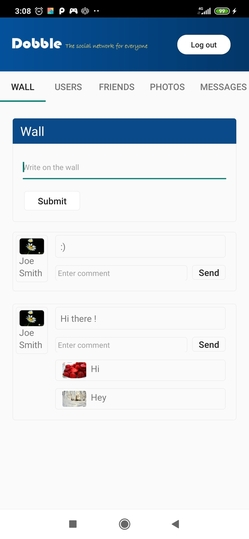
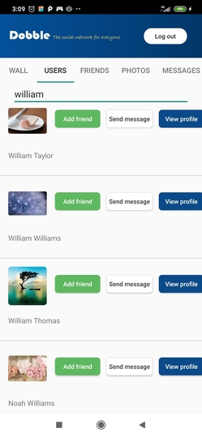
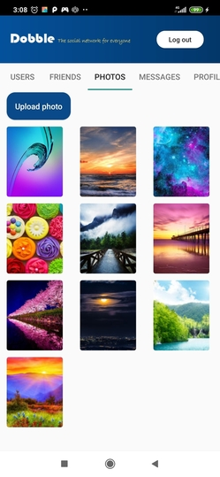

# Overview
> Android client for social network

Wall                       |  Users                    |  Photos
:-------------------------:|:-------------------------:|:-------------------------:
     |    | 
## Getting started
* Set BASE_URL by path src/main/java/com/example/dobble/release/repositories/remote/api/DobbleApi.java before build
## Code overview
## Dependencies
* [retrofit](https://square.github.io/retrofit/) - http client
* [rxJava](https://github.com/ReactiveX/RxJava) - library for convenient work with asynchronous tasks
* [dagger2](https://github.com/google/dagger) - compile-time dependency injection framework
* [glide](https://github.com/bumptech/glide) - image loading
* [room](https://github.com/android/architecture-components-samples) - high level abstraction over SQLite
* [socketIO](https://github.com/socketio/socket.io-client-java) - high level abstraction over WebSocket

## DevDependencies
* [checkstyle](https://github.com/checkstyle/checkstyle) - code style rules
## Application Structure
* ``` app/src/main/java/com/example/dobble/ ``` - root
    * ``` debug/ ``` - debug build type
        * ``` di/ ``` - dagger components and modules
        * ``` repositories/ ``` - fake* repositories
    * ``` release/ ``` - release build type
         * ``` di/ ``` - dagger
         * ``` dto/ ``` - data transfer objects
         * ``` extensions/ ``` - android extensions above View, EditView etc
         * ``` repositories/ ``` - layer for retrieving and caching data
              * ``` local/ ``` - classes for work with room
              * ``` remote/ ``` - classes relating to network
                   * ``` api/ ``` - api endpoints for retrofit
                   * ``` interceptors/ ``` - okhttp interceptors
                   * ``` payload/ ``` - retrofit payload for requests and responses
                        * ``` body/ ``` - request body
                        * ``` response/ ``` - response body
         * ``` ui/ ``` - presentation layer
              * ``` activities/ ``` - android activities
              * ``` adapters/ ``` - recyclerview adapters
              * ``` fragmetns/ ``` - android fragments
         * ``` utils/ ``` - common utils
         * ``` vm/ ``` - view model layer